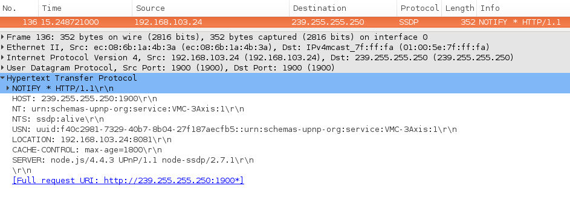
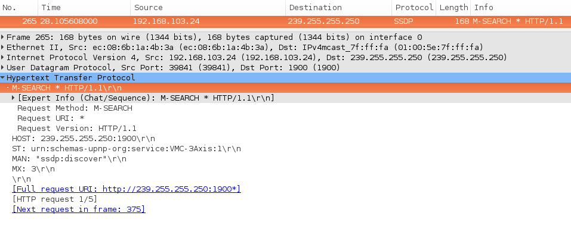
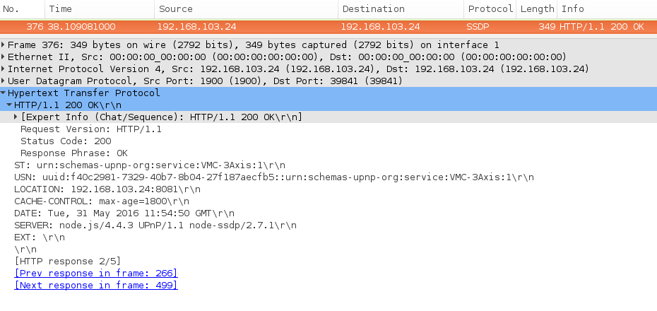
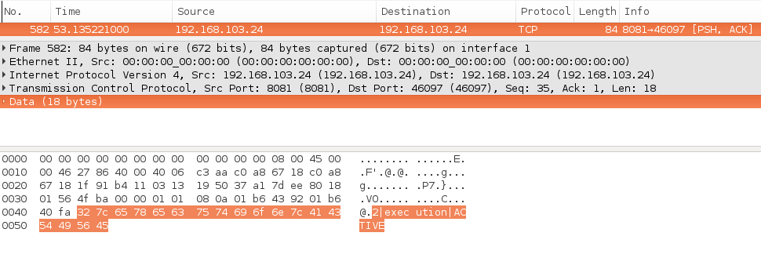

README
======

An implementation of the MTConnect Agent using Node.js.

INSTALL
-------

Install [Node](https://nodejs.org/en/). A reference documentation is available at:

https://www.digitalocean.com/community/tutorials/how-to-install-node-js-on-an-ubuntu-14-04-server

Install required modules from the top-level directory using:

    $ npm install

You can then start the server using:

    $ npm start

DEPENDENCIES
------------

You will require xmllint for XML-XSD validation. On Ubuntu, you can install the same using:

    $ sudo apt-get install libxml2-utils

On Windows, install the GitHub client, and you can run the
script\install-Windows.sh script from a Git shell prompt. This will
fetch and copy the pre-compiled 32-bit binaries in
C:\tools\libxml. You will still need to update the PATH environment
variable with 'C:\tools\libxml'.

You will need to obtain the MTConnect schemas that are used for
XML-XSD validation using the following command:

    $ git submodule update --init --recursive

Simulator
---------
There are few simulators avalaible at this moment. They can be found at the adapters folder. To run the adapter (simulator), use the following command:

    $ npm run simulator or $ npm run simulator2

The adapter will start sending UPnP NOTIFY messages in the network. It
will also contain LOCATION information providing the socket to read
data from.  A Wireshark capture is shown below:

You can start the agent as shown below:

    $ npm start

The agent will send UPnP M-SEARCH messages in the network. A sample
packet capture is given below:

The adapter will listen to M-SEARCH broadcasts, and if the Search
Target (ST) matches its description, it will respond with a "HTTP/1.1
OK" message as illustrated below:

Next, agent will request description of a device. After that agent will need to get schema for this device. The agent will then connect to this adapter and will receive simulated machine data. The following picture shows the agent receiving a
"execution ACTIVE" SHDR data.

Device schema
-------------
To get the Device schema. Run the agent and simulator in two command prompts.
Open a browser and type "http://localhost:8080/probe" in address bar or "http://localhost:3000/probe" if you are running simulator2

/probe
-------
Run the simulator and agent in two command prompts as mentioned in section Simulator.
After observing the M-SEARCH response as 'HTTP/1.1 200 OK",
open a web browser and type "http://localhost:7000/probe" to get the agent's devices and
the device's dataItems.

To get the probe response of a particular device, specify the device name in the request.
Eg: "http://localhost:7000/VMC-3Axis/probe"

/current
--------
Run the simulator and agent in two command prompts as mentioned in section Simulator.
After observing the M-SEARCH response as 'HTTP/1.1 200 OK",
open a web browser and type "http://localhost:7000/current"
in the address bar to get the device detail with current values in XML format.
You can specify 'path' and 'at'.
Eg at: "http://localhost:7000/current?at=100"
   path: "http://localhost:7000/current?path=//Axes"
   path and at: "http://localhost:7000/current?path=//Axes&at=100"
In path you can specify type, subType, name and category also.
Eg: 'path=//Rotary//DataItem[subType="OVERRIDE"]' or 'path=//Rotary//DataItem[type="LOAD"]' or 'path=//Linear[@name="Z" and @name="X"]//DataItem[@category="EVENT" and @category="SAMPLE"]' 

To get current of a particular device - "http://localhost:7000/VMC-3Axis/current" or
specify 'path=//Device[@name="VMC-3Axis"]'
"VMC-3Axis" is the device name  or specify 'path=//Device[@uuid="111"]' "111" is device's uuid. You can specify 2 or more at the same time 'path=//Device[@uuid="000" and @uuid="111"]' 

/sample
--------
Run the simulator and agent in two command prompts as mentioned in section Simulator.
After observing the M-SEARCH response as 'HTTP/1.1 200 OK",
open a web browser and type "http://localhost:7000/sample" in the adress bar to get the
sample - component's dataItems.

You can specify 'path' and 'from&count' also.
Eg: path:  "http://localhost:7000/sample?path=//Axes" or 
    path=//Linear[@name="Z" and @name="X"]//DataItem[@category="EVENT" and @category="SAMPLE"]

    from&count: "http://localhost:7000/sample?from=1037&count=6" PS: count should be within 10.
    path, from&count: "http://localhost:7000/sample?path=//Axes&from=10&count=6"
To get sample of a particular device - "http://localhost:7000/VMC-3Axis/sample"
"VMC-3Axis" is the device name or /sample?path=//Device[@uuid="111"] where uuid is device's uuid. You can specify 2 or more devices at the same time path=//Device[@uuid="111" and @uuid="000"]

/assets or /assets
------------------
Run the simulator and agent in two command prompts as mentioned in section Simulator.
After observing the M-SEARCH response as 'HTTP/1.1 200 OK",
open a web browser and type "http://localhost:7000/assets" or "http://localhost:7000/asset"
in the address bar to get all the assets.

To get details of a particular asset specify its assetId in the url
Eg: http://localhost:7000/asset/EM233. PS: EM233 is the assetId

Similarly multiple assets can be specified by separating the assetIds by ';'.
Eg: http://localhost:7000/asset/EM233;EM262

You can specify type of asset, count, device and removed 
Eg: type: /assets?type=CuttingTool,
    count: /assets?type=CuttingTool&count=2,
    device: /assets?device=VMC-3Axis,
    removed: /assets?removed=true, show all the assets even the ones that have been removed

You can use all of them together /assets?device=VMC-3Axis&type=CuttingTool&count=2. Order in which they appear does not matter.  

Development
-----------

Start the simulator. Simulator imitates a device on the network.

    npm run simulator

Start the agent. It will look for devices on network and act on them.

    npm run dev

`dev` instruction will boot node-dev server so you don't need to restart the server if you change code.

Tests
-----

Run all tests with 

    npm test

The unit and functional tests can be invoked using Mocha. An example
invocation is shown below:

    $ `npm bin`/mocha test/adapterTest.js
    simulator
      device
        ✓ streams data
        adapter
          ✓ can be found via UPnP
      fileServer
        ✓ serves xml def

    3 passing (95ms)

Code Climate
------

The [Airbnb JavaScript](https://github.com/airbnb/javascript) style guide is used as a reference. 

Lint
------
Use [standard](https://github.com/feross/standard) for linting `npm install -g standard`

To lint do `standard src/**/*.js src/*js`

To auto format files use `standard --fix src/filename.js`

Error and Exception Handling
----------------------------

The project includes error and exception handling code blocks to keep
the Agent running. You can test the simulator(adapter) and agent by
running them, and terminating each instance separately.

Docker
------

A Dockerfile has been added to the project. This allows us to:

1. Ship the Agent as a Docker image, and
2. Create a container environment in CI run the tests.

User Acceptance Testing (Standards)
-----------------------------------

You can generate the required integration/acceptance tests using the following command:

    $ `npm bin`/litpro doc/standard/upnp.md
    UNCHANGED ./build/upnp.js
    DONE: ./build

The above step will generate the required JavaScript files required to
run the tests. The actual invocation of the tests is illustrated
below:

    $ `npm bin`/mocha build/upnp.js
    simulator
      device
        ✓ streams data
        adapter
          ✓ can be found via UPnP
      fileServer
        ✓ serves xml def

    3 passing (95ms)

The Standards document in Markdown format can be generated using the
provided generate-standard.js utility as shown below:

    $ cd tools
    $ node generate-standard.js

The generated Markdown file is available in the build/ folder.

Coverage
--------

Istanbul code coverage tool has been integrated with the project. You
can generate coverage HTML reports using:

    $ npm run tc:test

## License

Copyright 2018, VIMANA. All rights reserved.

Licensed under the Apache License, Version 2.0 (the "License");
you may not use this file except in compliance with the License.
You may obtain a copy of the License at

    http://www.apache.org/licenses/LICENSE-2.0

Unless required by applicable law or agreed to in writing, software
distributed under the License is distributed on an "AS IS" BASIS,
WITHOUT WARRANTIES OR CONDITIONS OF ANY KIND, either express or implied.
See the License for the specific language governing permissions and
limitations under the License.
